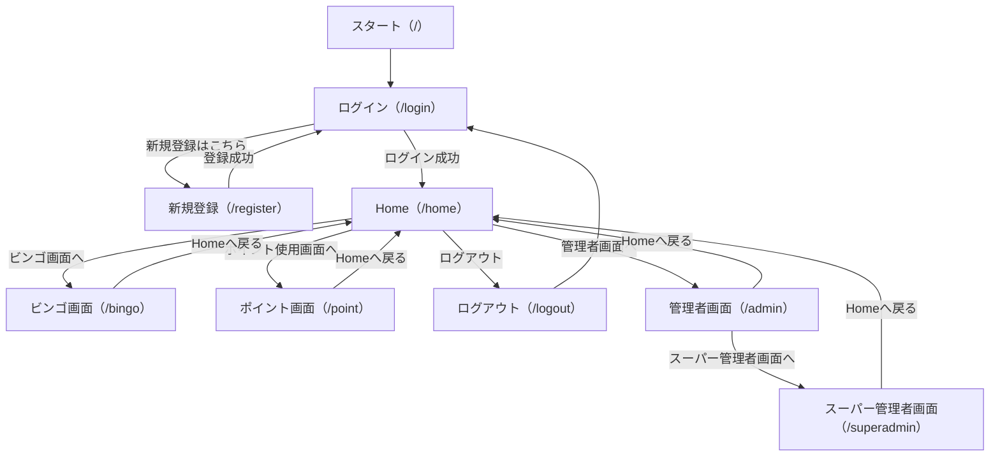
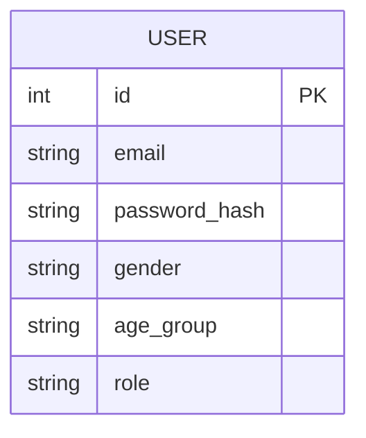

# maeda_app 基本設計書

---

## 1. システム概要

本アプリは、ユーザー登録・ログイン機能、ポイント・ビンゴ等の画面遷移、管理者（通常・スーパー）機能を持つWebアプリケーションです。Python（Flask）とSQLiteを用いて実装されています。

---

## 2. 画面構成・ルーティング

| ルート         | 画面名           | 概要・機能                                                                 |
|:--------------|:----------------|:---------------------------------------------------------------------------|
| `/`           | トップ          | `/login`へリダイレクト                                                     |
| `/login`      | ログイン        | メールアドレス・パスワードでログイン。未登録なら`/register`へ誘導           |
| `/register`   | 新規登録        | メール・パスワード・性別・年代を入力しユーザー登録                          |
| `/logout`     | ログアウト      | セッションをクリアし、`/login`へリダイレクト                                |
| `/home`       | Home            | ログイン後のメイン画面                                                     |
| `/bingo`      | ビンゴ画面      | ビンゴ機能画面                                                             |
| `/point`      | ポイント画面    | ポイント使用画面                                                           |
| `/admin`      | 管理者画面      | `maeda_app_root`以上の管理者のみアクセス可                                  |
| `/superadmin` | スーパー管理画面| `super_root`のみアクセス可                                                 |

---

## 3. 画面遷移図

---

## 4. データベース設計

### users テーブル

| カラム名        | 型           | 制約                | 説明                       |
|:---------------|:-------------|:--------------------|:---------------------------|
| id             | Integer      | PK, AutoIncrement   | ユーザーID                 |
| email          | String(120)  | Unique, NotNull     | メールアドレス             |
| password_hash  | String(128)  | NotNull             | パスワード（ハッシュ化）    |
| gender         | String(10)   |                     | 性別                       |
| age_group      | String(10)   |                     | 年代                       |
| role           | String(32)   | Default: 'user'     | 権限（super_root, maeda_app_root, user）|

---

## 5. ER図

---

## 6. 権限設計

- **super_root**  : 全体のスーパー管理者（全権限）
- **maeda_app_root** : maeda_appに関する管理機能のみ可能
- **user**        : 一般ユーザー。管理画面にはアクセス不可

---

## 7. 主な処理フロー

### 新規登録
1. `/register`でメール・パスワード・性別・年代を入力
2. メール重複チェック
3. パスワードはハッシュ化してDB保存
4. 登録後は`/login`へリダイレクト

### ログイン
1. `/login`でメール・パスワードを入力
2. DBで認証（パスワードはハッシュ照合）
3. 成功時はセッションにユーザー情報・roleを保存
4. `/home`へ遷移

### ログアウト
1. `/logout`でセッションをクリア
2. `/login`へリダイレクト

### 管理者画面
- `/admin`は`maeda_app_root`以上、`/superadmin`は`super_root`のみアクセス可
- アクセス制御はセッションのroleで判定

---

## 8. テンプレート構成

- `login.html`：メール・パスワード入力フォーム
- `register.html`：新規登録フォーム（メール・パスワード・性別・年代）
- `home.html`：Home画面
- `bingo.html`：ビンゴ画面
- `point_get.html`：ポイント画面
- `admin.html`：管理者画面（未実装）
- `superadmin.html`：スーパー管理者画面（未実装）

---

## 9. セキュリティ

- パスワードはハッシュ化して保存（Werkzeug利用）
- セッション管理にFlaskの`secret_key`を使用
- 管理画面はroleによるアクセス制御

---

## 10. 今後の拡張性

- roleカラムにより、他アプリ用のroot権限も容易に追加可能
- 管理者画面の機能追加やユーザー管理機能の拡張も容易