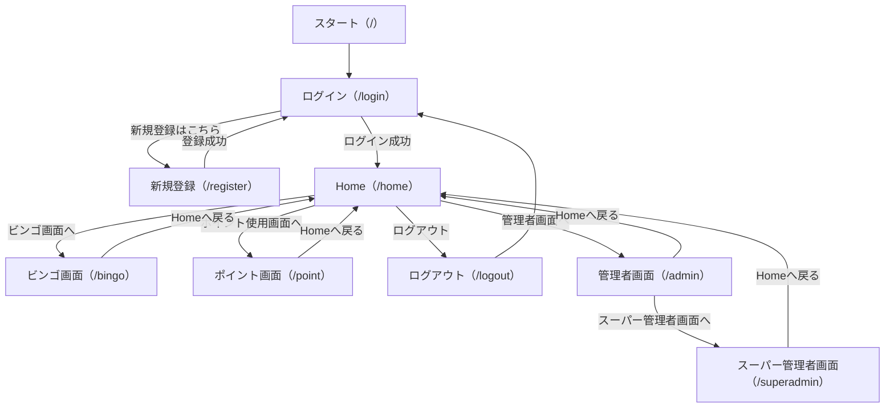
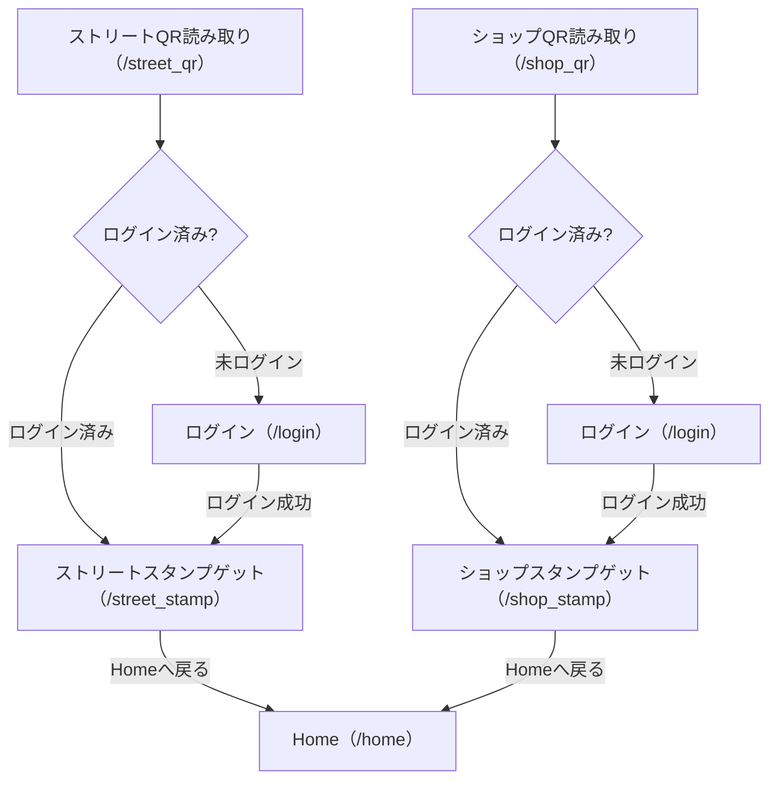

# maeda_app 基本設計書（全体＋ QR 機能）

---

## 1. システム概要

本アプリは、ユーザー登録・ログイン機能、ポイント・ビンゴ等の画面遷移、管理者（通常・スーパー）機能、そして QR コードからのスタンプゲット機能を持つ Web アプリケーションです。Python（Flask）と SQLite を用いて実装されています。

---

## 2. 画面構成・ルーティング（全体）

| ルート          | 画面名                 | 概要・機能                                                        |
| :-------------- | :--------------------- | :---------------------------------------------------------------- |
| `/`             | トップ                 | `/login`へリダイレクト                                            |
| `/login`        | ログイン               | メールアドレス・パスワードでログイン。未登録なら`/register`へ誘導 |
| `/register`     | 新規登録               | メール・パスワード・性別・年代を入力しユーザー登録                |
| `/logout`       | ログアウト             | セッションをクリアし、`/login`へリダイレクト                      |
| `/home`         | Home                   | ログイン後のメイン画面                                            |
| `/bingo`        | ビンゴ画面             | ビンゴ機能画面                                                    |
| `/point`        | ポイント画面           | ポイント使用画面                                                  |
| `/admin`        | 管理者画面             | `maeda_app_root`以上の管理者のみアクセス可                        |
| `/superadmin`   | スーパー管理画面       | `super_root`のみアクセス可                                        |
| `/street_qr`    | ストリート QR 入口     | ストリート用 QR からのアクセス。未ログイン時は/login へ           |
| `/shop_qr`      | ショップ QR 入口       | ショップ用 QR からのアクセス。未ログイン時は/login へ             |
| `/street_stamp` | ストリートスタンプ画面 | ストリート QR からのスタンプゲット画面                            |
| `/shop_stamp`   | ショップスタンプ画面   | ショップ QR からのスタンプゲット画面                              |

---

## 3. 画面遷移図（全体＋ QR 機能）

### (1) 全体画面遷移図

### (2) QR 機能画面遷移図

---

## 4. データベース設計

### users テーブル

| カラム名      | 型          | 制約              | 説明                                     |
| :------------ | :---------- | :---------------- | :--------------------------------------- |
| id            | Integer     | PK, AutoIncrement | ユーザー ID                              |
| email         | String(120) | Unique, NotNull   | メールアドレス                           |
| password_hash | String(128) | NotNull           | パスワード（ハッシュ化）                 |
| gender        | String(10)  |                   | 性別                                     |
| age_group     | String(10)  |                   | 年代                                     |
| role          | String(32)  | Default: 'user'   | 権限（super_root, maeda_app_root, user） |

---

## 5. ER 図

---

## 🧱 エンティティ定義（テーブル構造）

### 1. Users（ユーザー）

| カラム名 | 型 | 制約 | 説明 |
|----------|----|------|------|
| id | int | PK, auto increment | ユーザーID |
| email | varchar | UNIQUE, NOT NULL | ログイン用メールアドレス |
| password | varchar | NOT NULL | パスワード（ハッシュ） |
| gender | varchar |  | 性別 |
| age_group | varchar |  | 年齢層（例：10代, 20代など） |
| is_verified | boolean | default: false | メール認証済みかどうか |

---

### 2. Verifications（メール認証トークン）

| カラム名 | 型 | 制約 | 説明 |
|----------|----|------|------|
| id | int | PK | トークンID |
| user_id | int | FK → Users.id | 関連ユーザー |
| token | varchar | NOT NULL | 認証用トークン（URLに含まれる） |
| is_clicked | boolean | default: false | クリック済みかどうか |
| created_at | datetime | NOT NULL | 発行日時 |

---

### 3. QRScans（QRコードスキャン記録）

| カラム名 | 型 | 制約 | 説明 |
|----------|----|------|------|
| id | int | PK | スキャン記録ID |
| user_id | int | FK → Users.id | スキャンしたユーザー |
| qr_type | varchar | NOT NULL | 'shop' または 'street' |
| scanned_at | datetime | NOT NULL | スキャン日時 |

---

### 4. Points（累計ポイント）

| カラム名 | 型 | 制約 | 説明 |
|----------|----|------|------|
| id | int | PK | レコードID |
| user_id | int | FK → Users.id | 対象ユーザー |
| total_points | int | default: 0 | 累計ポイント数 |

---

### 5. BingoStates（ビンゴ状態）

| カラム名 | 型 | 制約 | 説明 |
|----------|----|------|------|
| id | int | PK | レコードID |
| user_id | int | FK → Users.id | 対象ユーザー |
| bingo_data | json | NOT NULL | ビンゴマスの状態（5×5の配列など） |
| last_updated | datetime | NOT NULL | 最終更新日時 |

---

## 🔗 リレーションシップ（関係図）

- Users 1 --- * Verifications  
- Users 1 --- * QRScans  
- Users 1 --- 1 Points  
- Users 1 --- 1 BingoStates  

---

## 📌 補足仕様

- QRコードアクセス時、ログインしていなければログイン画面へ遷移。
- QRスキャン後、対応するビンゴマス（主要 or 非主要）を開く。
- ポイントはQRの種類に関わらず加算される。
- ビンゴ状態（`bingo_data`）はバックグラウンドで随時更新。
- ビンゴ達成時にはユーザーに通知。

---

## 6. 権限設計

- **super_root** : 全体のスーパー管理者（全権限）
- **maeda_app_root** : maeda_app に関する管理機能のみ可能
- **user** : 一般ユーザー。管理画面にはアクセス不可

---

## 7. 主な処理フロー

### 新規登録

1. `/register`でメール・パスワード・性別・年代を入力
2. メール重複チェック
3. パスワードはハッシュ化して DB 保存
4. 登録後は`/login`へリダイレクト

### ログイン

1. `/login`でメール・パスワードを入力
2. DB で認証（パスワードはハッシュ照合）
3. 成功時はセッションにユーザー情報・role を保存
4. `/home`へ遷移

### ログアウト

1. `/logout`でセッションをクリア
2. `/login`へリダイレクト

### 管理者画面

- `/admin`は`maeda_app_root`以上、`/superadmin`は`super_root`のみアクセス可
- アクセス制御はセッションの role で判定

### QR 機能

- `/street_qr`・`/shop_qr`は未ログイン時にセッションで遷移先を記録し、ログイン後に該当スタンプ画面へ自動遷移
- ログイン済みなら即スタンプゲット画面へ

---

## 8. テンプレート構成

- `login.html`：メール・パスワード入力フォーム
- `register.html`：新規登録フォーム（メール・パスワード・性別・年代）
- `home.html`：Home 画面
- `bingo.html`：ビンゴ画面
- `point_get.html`：ポイント画面
- `street_stamp.html`：ストリートスタンプ画面
- `shop_stamp.html`：ショップスタンプ画面
- `admin.html`：管理者画面（未実装）
- `superadmin.html`：スーパー管理者画面（未実装）

---

## 9. セキュリティ

- パスワードはハッシュ化して保存（Werkzeug 利用）
- セッション管理に Flask の`secret_key`を使用
- 管理画面・スタンプゲット画面は role やログイン状態によるアクセス制御

---

## 10. 今後の拡張性

- role カラムにより、他アプリ用の root 権限も容易に追加可能
- 管理者画面の機能追加やユーザー管理機能の拡張も容易
- QR 種別追加やスタンプ種別追加も容易
