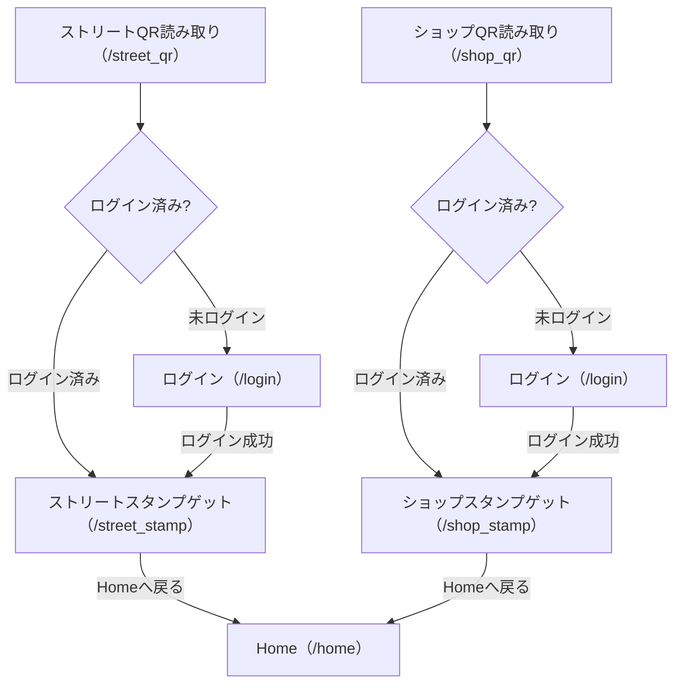
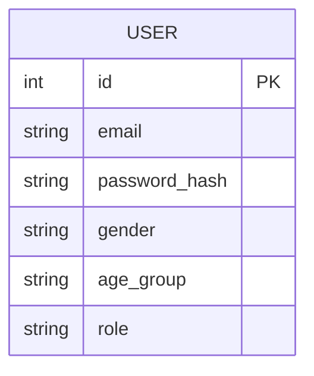

# maeda_app QR機能 基本設計書

---

## 1. システム概要（QR機能）

本設計は、QRコードからのアクセスによるスタンプゲット機能に関する設計です。
ユーザーがQRコード（ストリート用・ショップ用）を読み取ることで、
未ログイン時はログイン画面を経由し、ログイン後に該当スタンプゲット画面へ遷移します。

---

## 2. 画面構成・ルーティング（QR関連）

| ルート           | 画面名                 | 概要・機能                                               |
|:-----------------|:----------------------|:---------------------------------------------------------|
| `/street_qr`     | ストリートQR入口      | ストリート用QRからのアクセス。未ログイン時は/loginへ      |
| `/shop_qr`       | ショップQR入口        | ショップ用QRからのアクセス。未ログイン時は/loginへ        |
| `/login`         | ログイン              | メール・パスワードでログイン。QR経由時は自動遷移あり      |
| `/street_stamp`  | ストリートスタンプ画面| ストリートQRからのスタンプゲット画面                     |
| `/shop_stamp`    | ショップスタンプ画面  | ショップQRからのスタンプゲット画面                       |

---

## 3. 画面遷移図（QR機能）

---

## 4. データベース設計（QR機能関連）

QR機能自体はusersテーブルを利用します。

### users テーブル

| カラム名        | 型           | 制約                | 説明                       |
|:---------------|:-------------|:--------------------|:---------------------------|
| id             | Integer      | PK, AutoIncrement   | ユーザーID                 |
| email          | String(120)  | Unique, NotNull     | メールアドレス             |
| password_hash  | String(128)  | NotNull             | パスワード（ハッシュ化）    |
| gender         | String(10)   |                     | 性別                       |
| age_group      | String(10)   |                     | 年代                       |
| role           | String(32)   | Default: 'user'     | 権限（super_root, maeda_app_root, user）|

---

## 5. ER図

---

## 6. 主な処理フロー（QR機能）

### ストリートQR
1. `/street_qr`にアクセス
2. 未ログインなら`/login`へリダイレクトし、ログイン後`/street_stamp`へ遷移
3. ログイン済みなら即`/street_stamp`へ

### ショップQR
1. `/shop_qr`にアクセス
2. 未ログインなら`/login`へリダイレクトし、ログイン後`/shop_stamp`へ遷移
3. ログイン済みなら即`/shop_stamp`へ

---

## 7. セキュリティ・補足

- QR経由のアクセスも通常のログイン認証・セッション管理を利用
- スタンプゲット画面はログイン必須
- 不正アクセス防止のため、セッション管理・リダイレクト制御を徹底 